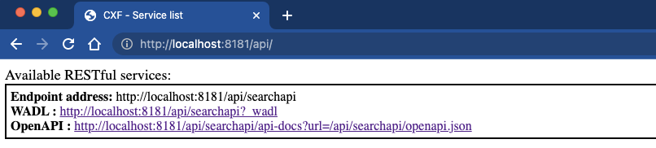
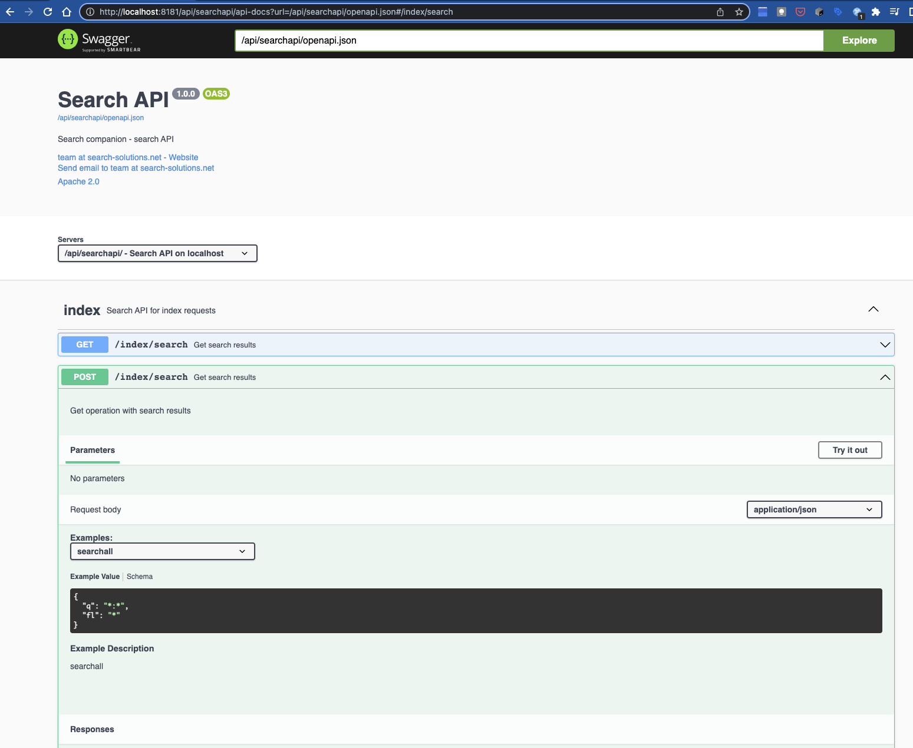

# Welcome to search-companion

search-companion.org is working on open source tools to help technical people to interact with the open source search engine Solr ([https://solr.apache.org](https://solr.apache.org)).
The functionality is based on apache camel ([https://camel.apache.org](https://camel.apache.org)) application.
The search-companion components are deployed in an apache karaf container ([https://karaf.apache.org](https://karaf.apache.org)) via "search-companion" karaf features.

- The docker image of the karaf container is available [here](https://hub.docker.com/repository/docker/searchcompanion/karaf) on docker hub
- The karaf features xml can be found [here](https://mvn.search-companion.org/mvnrepo/companion/org/search-companion/companion-karaf-features/0.8.4/companion-karaf-features-0.8.4-features.xml/)
- The karaf distro can be found [here](https://mvn.search-companion.org/mvnrepo/companion/org/search-companion/companion-karaf/0.8.4/companion-karaf-0.8.4.tar.gz)

### Quick start demo
The easiest way to see the search-companion functionality in action, is to run the searchcompanion/karaf docker container in an example "docker compose" network with a zoo/solr ensemble and an example db.
See the companion-demo [README page](https://github.com/search-companion/companion-demo)

### search-companion features deployed in karaf

- **data-import**: alternative and robust solution that replaces the deprecated solr DIH (dataimporthandler); basically taking care of the data synchronisation between a datasource and solr
- **config-upload**: a solution that enables non IT people to load solr config files (dictionaries, synonyms, ...) into zookeeper via a folder watcher (with optional post-processing tasks e.g. spellcheck build)
- **querqy-upload**: a querqy rules upload routine based on a folder watcher that generates rules for a querqy rewriter from csv files
- **searchapi**: extendable REST search API that decouples your search API from the search implementation with swagger UI (jaxrs-server and Apache CXF as the implementation of the JAXRS specification); a necessity unless you will only allow 1 client to access your search engine; 

REST service list:

; 

OpenAPI 3 Swagger UI: 

### search-companion source code on GitHub

[https://github.com/search-companion/companion](https://github.com/search-companion/companion)

### Contact

Please contact us via [email](mailto:info@search-companion.org).
We're open to suggestions, enhancements and feedback and welcome all possible participations to this project.
